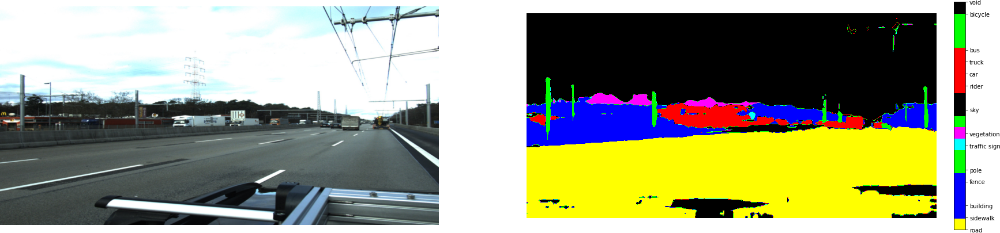

# Siemens Hackathon

# P2X Points to Everything #

This is joint project of our teammebers.
The product provides the segmented point cloud based on the data collected from LIDAR data and from three cameras attached to left, center and right side of the image.

Segmented point clouds helps the engineers for faster visualization of the 3d space.

The product has the potential to extract valuable information from segmented point clouds like instances of objects like how many cars nearby, objects like side rails around you. Such information will aid eHighway project for better planning.

Future prospective of the work is to use state of the art point cloud architectures ( PointNet++) to calculate import information like minimum distance of car from side-rails, gap between  bridge and car, distance from lanes. Such information are essential for automatic driving applications. Extended target is to conncet point cloud information of each car to the cloud in order to prevent fatal accident on the road.

## We read roads!!!##

## Segmentations using pre-trained DeepLabV3 ##

